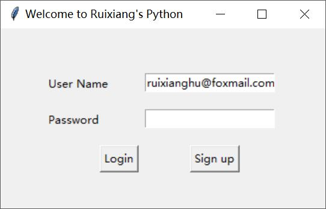

# 观看指南
## 这是我学习Python Tkinter时写的一些小demo，享与诸君，多多指教。

### 1、登录注册窗体
+ login.py是用Python Tkinter写的一个登陆注册小窗口，可实现用户的登陆与注册的功能，并涵盖了“用户名为空”“密码错误”“注册用户名已存在”“两次密码不一致”等异常处理。
+ account.pickle用以存储注册的账户信息，可以实现动态更新。

> - 登录
>

